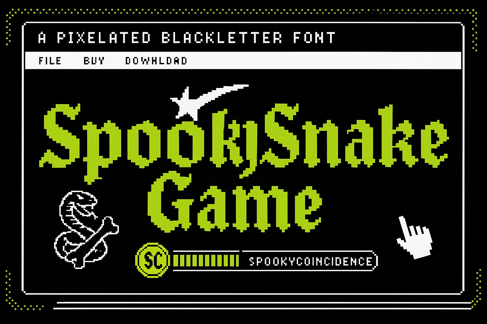

## Spooky Snake Game

Spooky Snake Game es un juego clásico de la serpiente desarrollado con Next.js y TailwindCSS.

👉 **Deploy en Vercel**: 


## Características
* Juego clásico de la serpiente con movimiento suave y controles con teclado (flechas)
* Pantalla de inicio, pausa y reinicio
* Game over con opción de reiniciar partida
* Diseño responsive y minimalista con Tailwind CSS
* Código moderno en TypeScript con React hooks y Next.js 13 (app router)
* Funciona en cualquier navegador moderno

Instalación y uso
1. Clonar el repositorio:
```bash
git clone https://github.com/spookycoincidence/SpookySnakeGame.git
```
2. Instalar dependencias:
```bash
cd SpookySnakeGame
npm install
```
3. Correr la app en modo desarrollo:
```bash
npm run dev
```
4. Abrir http://localhost:3000 en el navegador

## Estructura del proyecto
* src/app - Contiene las páginas y componentes principales (Next.js 13 app directory)
* src/app/components/GameBoard.tsx - Lógica y renderizado del tablero del juego
* public/ - Imágenes y assets estáticos
* styles/ - Estilos globales y configuración de Tailwind CSS

## Scripts disponibles
* npm run dev - Inicia servidor de desarrollo
* npm run build - Construye la app para producción
* npm run start - Inicia servidor en modo producción
* npm run lint - Corre el linter para detectar errores de código

## Tecnologías
* Next.js 13
* React 18
* TypeScript
* Tailwind CSS

## Desarrollado con ❤️ por spookycoincidence